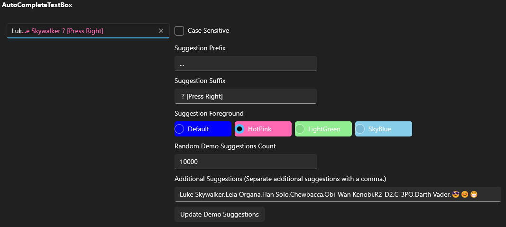
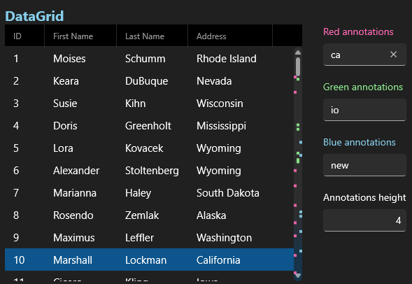

# 🧰 AK.Toolkit

The AK.Toolkit will be a collection of controls, helpers, etc... stuff that I need but couldn't find somewhere else.

## 🔵 WinUI 3

### 💻 AutoCompleteTextBox

[🎬 YouTube](https://youtu.be/G17jbGSXLnk)

A TextBox control that shows a suggestion based on input.
AutoCompleteTextBox shows a suggestion **inside** the TextBox control.

```xaml
<toolkit:AutoCompleteTextBox
    IsSuggestionCaseSensitive="false"
    SuggestionForeground="HotPink"
    SuggestionPrefix="..."
    SuggestionSuffix=" ? [Press Right]"
    SuggestionsSource="{x:Bind Suggestions, Mode=OneWay}" />
```



### 🔢 NumberBoxEx

[🎬 YouTube](https://youtu.be/ai-koyvgbWY)

In addition to the built-in `NumberBox`:

- **NumberHorizontalAlignment** DependencyProperty
- **IsDeleteButtonVisible** DependencyProperty

Coming soon:

- Thousand separators
  - Comma
  - Space

### ⚒️ ScrollBarExtensions.KeepExpanded

[🎬 YouTube](https://youtu.be/8m82fXl0LKk)

An attached property that keeps `ScrollBars` expanded.

```xaml
<!--  ScrollBar  -->
<ScrollBar toolkit:ScrollBarExtensions.KeepVerticalExpanded="True" />
<!-- ScrollViewer  -->
<ScrollViewer
    toolkit:ScrollBarExtensions.KeepHorizontalExpanded="True"
    toolkit:ScrollBarExtensions.KeepVerticalExpanded="True">
    <ItemsRepeater />
</ScrollViewer>
<!--  ListView  -->
<ListView toolkit:ScrollBarExtensions.KeepVerticalExpanded="True" />
<!--  GridView  -->
<GridView toolkit:ScrollBarExtensions.KeepVerticalExpanded="True" />
<!-- NavigationView  -->
<NavigationView toolkit:ScrollBarExtensions.KeepVerticalExpanded="True" />
```

### ⚒️ ScrollBarExtensions.Annotations

[🎬 YouTube](https://youtu.be/wa6_E_HpiMg)

An attached property that adds annotations to vertical `ScrollBars`.

First, you need to create a collection of your annotations that implements ``IAnnotation`` or just use the built-in ``BasicAnnotation``.

```csharp
public interface IAnnotation
{
    double Value { get; }

    ValueType ValueType { get; }

    Shape Shape { get; }

    double LeftOffset { get; }
}

public record BasicAnnotation : IAnnotation
{
    public double Value { get; }

    public ValueType ValueType { get; set; }

    public Shape Shape { get; private set; }

    public double LeftOffset { get; set; }

    public BasicAnnotation(double value, Shape shape)
    {
        Value = value;
        Shape = shape;
    }
}
```

Then bind your annotations using ``ScrollBarExtensions.VerticalAnnotations`` attached property.

```xaml
<controls:DataGrid
    toolkit:ScrollBarExtensions.KeepVerticalExpanded="True"
    toolkit:ScrollBarExtensions.VerticalAnnotations="{x:Bind Annotations, Mode=OneWay}"
    ItemsSource="{x:Bind Users}">
```



## 🗑️ Deprecated

### 🌏 Localizer

> **Note**: Localizer has been replaced with [WinUI3Localizer](https://github.com/AndrewKeepCoding/WinUI3Localizer).

[🎬 YouTube](https://youtu.be/6Y5saLQ9bcs)

Localizer helps you to localize your app.

- Switch languages **without restarting** the app
- You (users) can **edit** localized strings even after deployment
- You (users) can **add** new languages even after deployment
- Use the starndard **Resources.resw**
